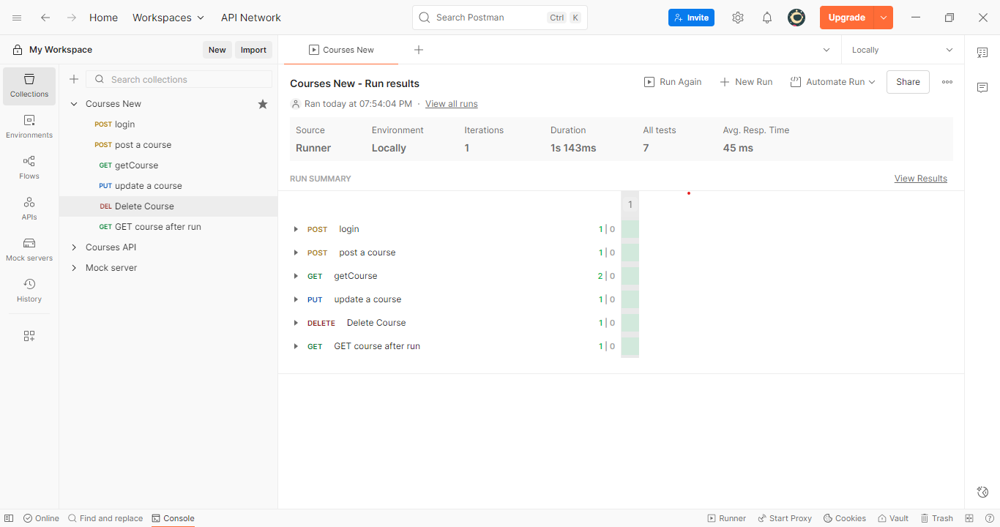
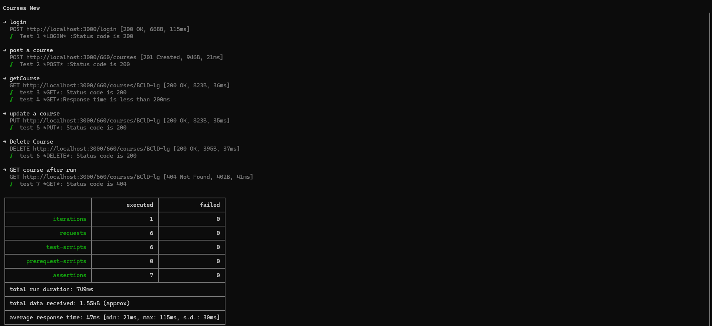
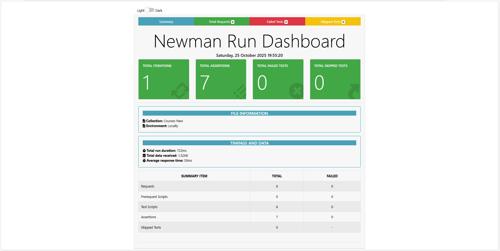
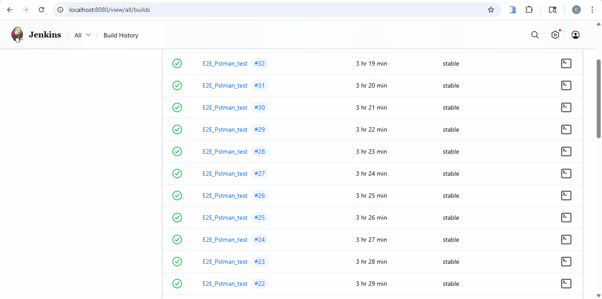
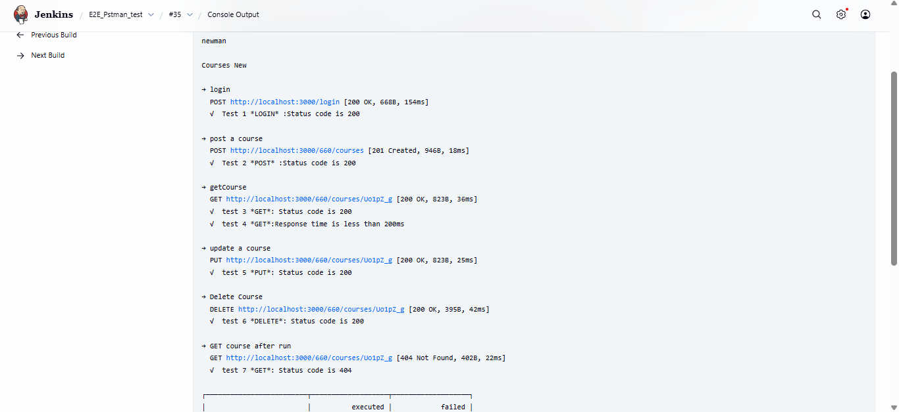
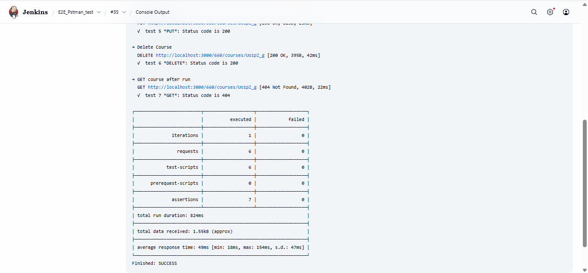

# 🛡️ E2E API Testing Project: Courses Application

🌐 **Project Documentation:** [Postman E2E Testing Project](https://github.com/AmelChenni/-E2E-API-Testing-Project-Courses-Application/tree/main)  

---

## 📖 Description
This repository demonstrates the practical application of **End-to-End (E2E) API testing** using **Postman**, **Newman**, and **Jenkins**, learned during a complete Postman course.

The project tests a **Courses API** with **CRUD operations** (`login`, `post a course`, `get course`, `update course`, `delete course`) and covers **functional, negative, and response validation testing**, along with automated execution and CI/CD.

### Key Project Deliverables
- **Comprehensive API Test Collection**: Covers all endpoints with assertions on status codes, response times, and payloads.  
- **Automated Test Execution**: Implemented with **Newman CLI** and **HTML reports** using `htmlextra`.  
- **CI/CD Pipeline**: Configured **Jenkins** to run E2E tests automatically, including scheduled runs.  
- **Test Documentation**: Organized **Excel sheets** for Test Cases and Bug Reports.  

---

## 🚀 Key QA Skills & Features
- **🔬 API Functional & Negative Testing**: Validated all endpoints and tested invalid inputs.  
- **📝 Assertions & Response Validation**: Status codes, response times, JSON structure validation.  
- **📊 Reporting & Documentation**: Generated **HTML reports** and tracked results in **Excel/Sheets**.  
- **🔄 CI/CD Implementation**: Automated test execution in Jenkins every minute or on demand.  
- **📌 Environment & Global Variables**: Managed environments in Postman for local and mock servers.  
- **🛡️ Basic Security Checks**: Authentication tests and secured paths tested.  

---

## 🛠️ Technologies Used
- **Postman** — API testing and collection management  
- **Newman & Newman htmlextra** — CLI automation and HTML reporting  
- **Jenkins** — CI/CD setup for automated test runs  
- **Insomnia** — Optional tool for API testing and comparison  
- **Google Sheets / Excel** — Test case and bug tracking  
- **Node.js / JSON Server** — Fake server for local testing  
- **VS Code** — Development environment  

---

## 📌 Project Status  

| Task | Status | Notes |
|------|--------|-------|
| API Test Collection creation | ✅ Completed | All endpoints covered |
| Test Assertions & Scripts | ✅ Completed | Status codes, payloads, response time validated |
| Automated Execution (Newman) | ✅ Completed | CLI & HTML report generated |
| CI/CD Setup (Jenkins) | ⚡ In Progress | Scheduled runs implemented |
| Test Documentation | ⚡ In Progress | Excel sheets for Test Cases and Bug Reports |
| Additional Security & Performance Testing | ❌ Planned | Future improvements |

---
## 📷 Preview

### 🧩 1. Postman Collection Run
Demonstrates running the complete API Test Collection manually inside Postman to verify all endpoints.

---

### ⚙️ 2. Newman CLI Execution
Shows automated test execution via the command line using Newman — validating endpoints, status codes, and assertions.

---

### 📊 3. Newman HTML Report
Displays the detailed HTML report generated by Newman with `htmlextra`, showing passed/failed requests, response times, and summary metrics.

---

### 🧠 4. Jenkins Scheduled Build (Every Minute)
Illustrates Jenkins automation setup to trigger API tests automatically every minute — demonstrating CI/CD integration.

---

### ✅ 5. Jenkins Build Result & Logs
Example of a successful Jenkins build execution, including console output and Newman summary within Jenkins.

---

## 📌 Future Scope & Improvements
- **SQL / Database Validation**: Verify backend data after API calls  
- **UI Testing**: Extend testing using **Cypress / Playwright**  
- **Advanced CI/CD**: Integrate Docker or GitHub Actions for cross-platform automation  
- **Performance Testing**: Add load/stress testing using **JMeter** or **Locust**  
- **Security Testing**: Test authentication, authorization, and common vulnerabilities more deeply  

---

## 📄 What to Add Before Uploading to GitHub
1. **Postman Collection File** (`.json`)  
2. **Newman HTML Report** (`htmlextra`)  
3. **Excel / Google Sheets**: Test Cases & Bug Reports  
4. **Screenshots** of Jenkins run, Newman report, and sample API responses  
5. **Environment Files** from Postman if you want to share variables  
6. **Certificate** or proof of course completion (optional, for LinkedIn)
